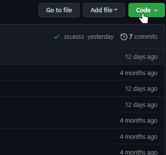

# Cinema HD

An application use Firebase for hosting and datebase, built with React, Redux, JavaScript, and SCSS.

## Project Status

This project is currently done. Users can sing up and sing in with Google or email and passwod, can mix them, change password, watch a movie, TV series, trailer, read about them, add favorites and look for what you want.

## Project Screen Shots

## Installation and Setup Instructions

Open [https://cinema-dev-v1.firebaseapp.com/](https://cinema-dev-v1.firebaseapp.com/) to view it in the browser.

Clone down this repository. You will need firebase account and `node`, `npm` installed globally on your machine.

Installation:

Clone repository

`git clone https://github.com/Avalanche322/Cinema.git`  

Open folder

`cd Cinema-master`

Install node modules:

`npm install`

To create `.env.local` (API Google Firebase, API TMDB)

You must open your IDE and create `.env.local` in root folder.

REACT_APP_API_KEY= API KEY  
REACT_APP_AUTH_DOMAIN= AUTH DOMAIN  
REACT_APP_PROJECT_ID= PROJECT ID  
REACT_APP_STORAGE_BUCKET= STORAGE BUCKET  
REACT_APP_MESSAGING_SENDER_ID= MESSAGING SENDER ID  
REACT_APP_APP_ID= APP ID  
REACT_APP_MEASUREMENT_ID= MEASUREMENT ID  
REACT_APP_CINEMA_API_KEY= CINEMA API KEY  

To Start Server:

`npm run start`  

To Visit App:

`http://localhost:3000` 
